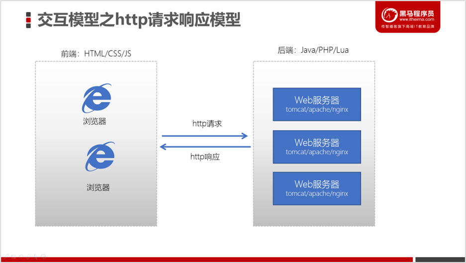
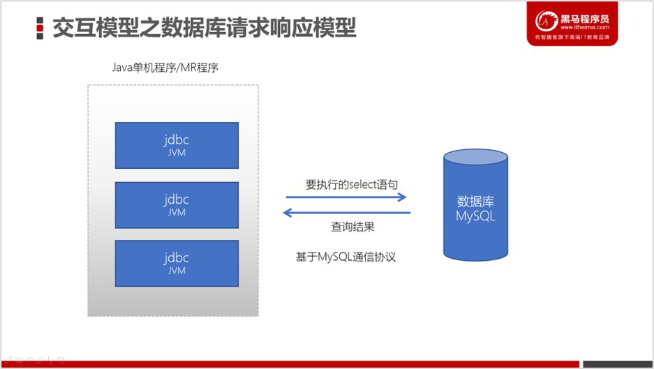
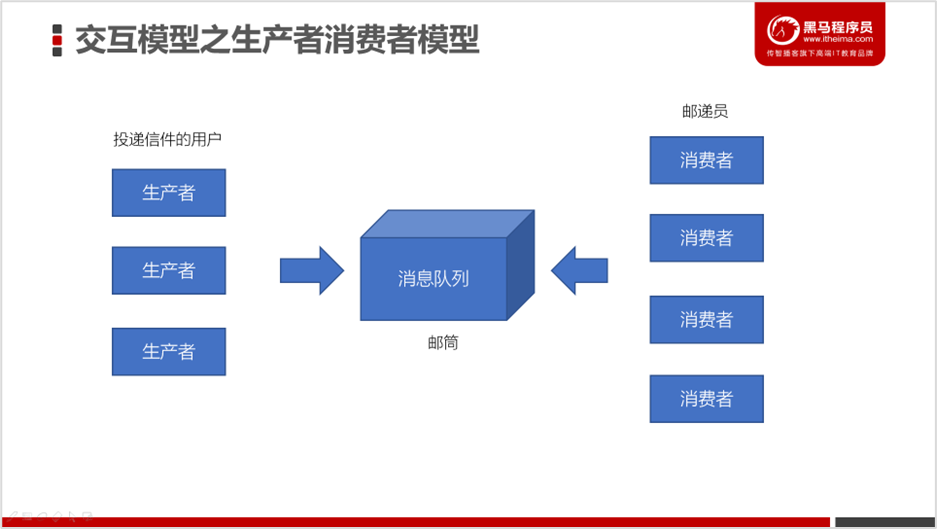
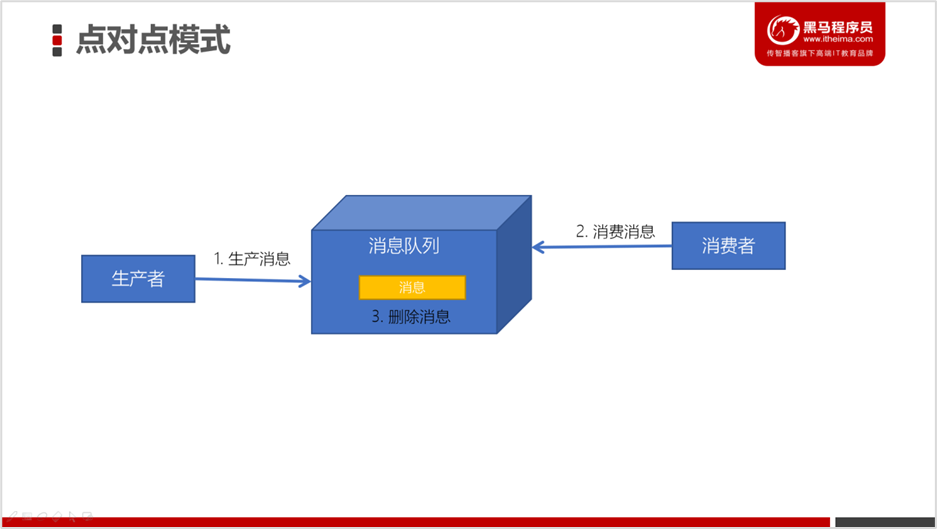
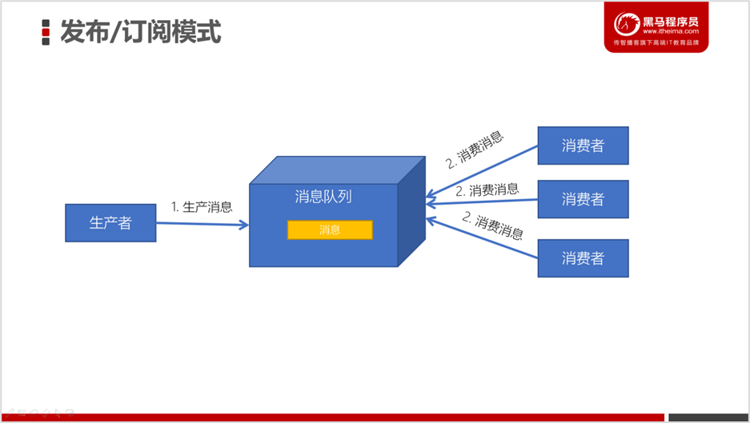
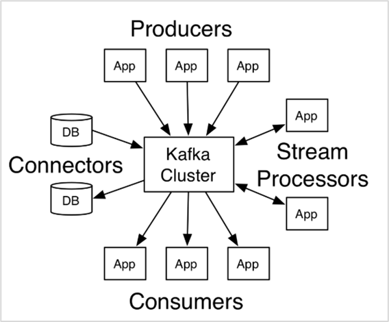

# Kafka

ITheima + shangguigu

## 简介

### 消息队列

#### 什么是消息队列？

消息队列，英文名：Message Queue，经常缩写为MQ。从字面上来理解，消息队列是一种用来存储消息的队列。

```java
// 1. 创建一个保存字符串的队列
Queue<String> stringQueue = new LinkedList<String>();

// 2. 往消息队列中放入消息
stringQueue.offer("hello");

// 3. 从消息队列中取出消息并打印
System.out.println(stringQueue.poll());

```

上述代码，创建了一个队列，先往队列中添加了一个消息，然后又从队列中取出了一个消息。这说明了队列是可以用来存取消息的。

我们可以简单理解消息队列就是**将需要传输的数据存放在队列中**。

#### 中间件？

消息队列中间件就是用来存储消息的软件（组件）。举个例子来理解，为了分析网站的用户行为，我们需要记录用户的访问日志。这些一条条的日志，可以看成是一条条的消息，我们可以将它们保存到消息队列中。将来有一些应用程序需要处理这些日志，就可以随时将这些消息取出来处理。

目前市面上的消息队列有很多，例如：Kafka、RabbitMQ、ActiveMQ、RocketMQ、ZeroMQ等。

#### 为什么叫Kafka

Kafka的架构师jay kreps非常喜欢franz kafka（弗兰兹·卡夫卡）,并且觉得kafka这个名字很酷.

#### 消息队列应用场景

1. #####   异步处理

   电商网站中，新的用户注册时，需要将用户的信息保存到数据库中，同时还需要额外发送注册的邮件通知、以及短信注册码给用户。但因为发送邮件、发送注册短信需要连接外部的服务器，需要额外等待一段时间，此时，就可以使用消息队列来进行异步处理，从而实现快速响应。

2. ##### 系统解耦

3. ##### 流量削峰

4. #####  日志处理（大数据领域常见）

   大型电商网站（淘宝、京东、国美、苏宁...）、App（抖音、美团、滴滴等）等需要分析用户行为，要根据用户的访问行为来发现用户的喜好以及活跃情况，需要在页面上收集大量的用户访问信息。

#### 生产者，消费者模型

Java服务器端开发的交互模型是这样的：



使用Java JDBC来访问操作MySQL数据库，它的交互模型是这样的：



它也是一种请求响应模型，只不过它不再是基于http协议，而是基于MySQL数据库的通信协议。

而如果我们基于消息队列来编程，此时的交互模式成为：生产者、消费者模型。



#### 消息队列的两种形式

##### 点对点形式



消息发送者生产消息发送到消息队列中，然后消息接收者从消息队列中取出并且消费消息。消息被消费以后，消息队列中不再有存储，所以消息接收者不可能消费到已经被消费的消息。

 点对点模式特点：

- 每个消息只有一个接收者（Consumer）(即一旦被消费，消息就不再在消息队列中)
- 发送者和接收者间没有依赖性，发送者发送消息之后，不管有没有接收者在运行，都不会影响到发送者下次发送消息；
- 接收者在成功接收消息之后需向队列应答成功，以便消息队列删除当前接收的消息；

##### 发布订阅模式



发布/订阅模式特点：

- 每个消息可以有多个订阅者；
- 发布者和订阅者之间有时间上的依赖性。针对某个主题（Topic）的订阅者，它必须创建一个订阅者之后，才能消费发布者的消息。
- 为了消费消息，订阅者需要提前订阅该角色主题，并保持在线运行；

## Kafka 简介

### 什么是Kafka

Kafka是由Apache软件基金会开发的一个开源流平台，由Scala和Java编写。Kafka的Apache[官网](http://kafka.apache.org/documentation/#introduction)是这样介绍Kakfa的：

>   Apache Kafka是一个分布式流平台。一个分布式的流平台应该包含3点关键的能力：  
>
> 1. 发布和订阅流数据流，类似于消息队列或者是企业消息传递系统 
> 2. 以容错的持久化方式存储数据流  
> 3. 处理数据流

### Kafka 应用场景

我们通常将Apache Kafka用在两类程序：

1. 建立实时数据管道，以可靠地在系统或应用程序之间获取数据
2. 构建实时流应用程序，以转换或响应数据流



上图，我们可以看到：

1. Producers：可以有很多的应用程序，将消息数据放入到Kafka集群中。
2. Consumers：可以有很多的应用程序，将消息数据从Kafka集群中拉取出来。
3. Connectors：Kafka的连接器可以将数据库中的数据导入到Kafka，也可以将Kafka的数据导出到数据库中。

4. Stream Processors：流处理器可以Kafka中拉取数据，也可以将数据写入到Kafka中。

### Kafka 诞生背景

kafka的诞生，是为了解决**linkedin**的数据管道问题，起初linkedin采用了ActiveMQ来进行数据交换，大约是在2010年前后，那时的ActiveMQ还远远无法满足linkedin对数据传递系统的要求，经常由于各种缺陷而导致消息阻塞或者服务无法正常访问，为了能够解决这个问题，linkedin决定研发自己的消息传递系统，当时linkedin的首席架构师jay kreps便开始组织团队进行消息传递系统的研发。

### Kafka 的优势

| 特性              | ActiveMQ     | RabbitMQ               | Kafka                | RocketMQ       |
| ----------------- | ------------ | ---------------------- | -------------------- | -------------- |
| 所属社区/公司     | Apache       | Mozilla Public License | Apache               | Apache/Ali     |
| 成熟度            | 成熟         | 成熟                   | 成熟                 | 比较成熟       |
| 生产者-消费者模式 | 支持         | 支持                   | 支持                 | 支持           |
| 发布-订阅         | 支持         | 支持                   | 支持                 | 支持           |
| REQUEST-REPLY     | 支持         | 支持                   | -                    | 支持           |
| API完备性         | 高           | 高                     | 高                   | 低（静态配置） |
| 多语言支持        | 支持JAVA优先 | 语言无关               | 支持，JAVA优先       | 支持           |
| 单机呑吐量        | 万级（最差） | 万级                   | **十万级**           | 十万级（最高） |
| 消息延迟          | -            | 微秒级                 | **毫秒级**           | -              |
| 可用性            | 高（主从）   | 高（主从）             | **非常高（分布式）** | 高             |
| 消息丢失          | -            | 低                     | **理论上不会丢失**   | -              |
| 消息重复          | -            | 可控制                 | 理论上会有重复       | -              |
| 事务              | 支持         | 不支持                 | 支持                 | 支持           |
| 文档的完备性      | 高           | 高                     | 高                   | 中             |
| 提供快速入门      | 有           | 有                     | 有                   | 无             |
| 首次部署难度      | -            | 低                     | 中                   | 高             |

### 使用 Kafka 的公司

|  |  |  |
| ------------------------------------------------------------ | ------------------------------------------------------------ | ------------------------------------------------------------ |
|  |  |  |
|  |  |  |
|  |  |  |
|  |  |  |
|  |  |  |
|  |  |  |

### Kafka 生态圈

[Kafka生态圈](https://cwiki.apache.org/confluence/display/KAFKA/Ecosystem)

## 环境搭建

转[尚硅谷最新版Kafka]( https://www.bilibili.com/video/BV1Gp421m7UN/?p=6&share_source=copy_web&vd_source=fffc49a66c25469755e54e5ddf015f57)

